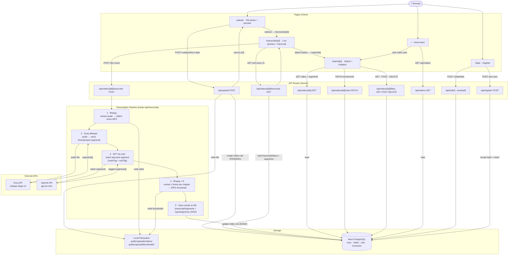
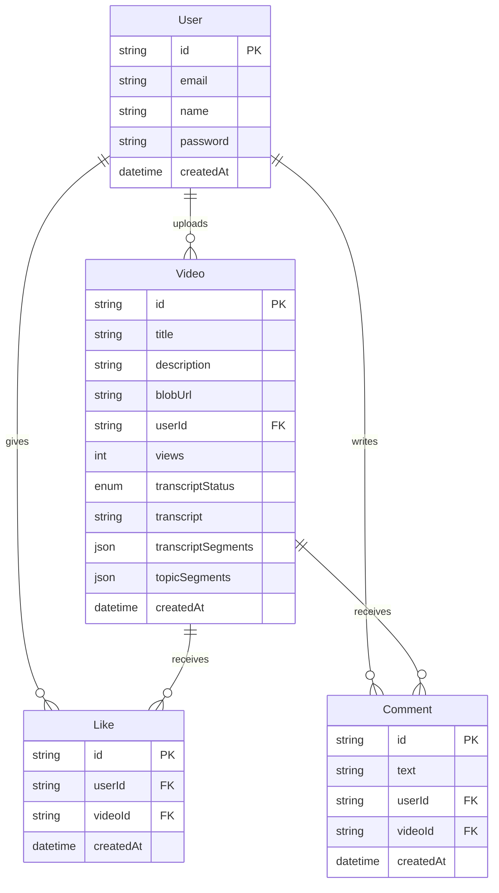

# Architecture

## Stack
| Layer | Tech |
|-------|------|
| Frontend | Next.js 14 App Router · Tailwind CSS |
| Auth | NextAuth.js (email + bcrypt) |
| Database | Neon PostgreSQL via Prisma |
| File Storage | Local filesystem (`public/uploads/`) |
| Transcription | Groq Whisper (LPU, ~10s) |
| AI Tagging | OpenAI GPT-4o-mini |
| Video Processing | ffmpeg-static (audio extract + thumbnails) |

---

## Full System Flow



---

## Data Model



---

## Upload → Watch in 60 seconds

```
User selects file
  → browser extracts thumbnail frame (canvas API) for preview
  → POST /api/upload → saved to public/uploads/videos/ + DB row created
  → redirect to /transcribe/[id]

/transcribe/[id] loads
  → POST /api/transcribe fires (once)
  → page polls GET /api/transcript every 2s

Pipeline (max 300s):
  ffmpeg extracts audio
  → Groq Whisper → N timed segments
  → GPT-4o-mini tags each segment (mainTag + subTag) in batches of 20
  → ffmpeg extracts 1 JPEG thumbnail per chapter (up to 10 parallel)
  → DB updated: status=DONE, transcriptSegments, topicSegments

Poll detects DONE → page shows transcript + chapter grid

User clicks "Watch" → /watch/[id] → full player + chapter sidebar
```
